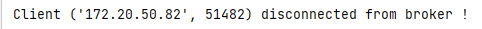
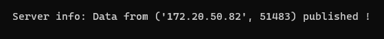
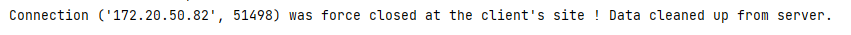

# Short introduction of HVLP protcol

HVLP (Hilscher Variable Length Protocol) is a simplified version of the MQTT protocol used for 
training purposes.
There are two main type of participants in the network: **broker**(acts like server) and **clients**, which
publish or receive data or both of them. Each client is connected to the broker and subscribed for
any topic like temperature, humidity, open or closed trigger and so on. If a client having a 
sensor for detecting some of listed above topics(parameters) publish a message(data) to the broker,
it distributes this data to every subscribed for the topic clients excluding publisher. The lower 
level protocols to establish the connection between the clients adn broker is TCP/IP.

Diagram of HVLP connection is illustrated below

Available commands(messages) to the broker:

Every message must consists Header with operation ID to define what client wants from server and 
payload length integer. Payload is not mandatory, it consists topic(s) and data if it is necessary.

**********

Below I'll introduce my interpretation of HVLP broker and client, that were developed for Python 2.7, 
but has compatibility with Python 3 too.

First of all download the folder HVLP which contents all needed files to run Broker and Client.

## <ins>*HVLP broker*

To start the server(broker) you have to start a command prompt or use any other program that is more 
convenient to you but gives you access to command prompt and type in HVLP downloaded folder:

Broker starts and indicates that with showed upper message.

The server(broker) has no many options to configure, it is set up and fully autonomous. The base 
thing which you must configure before use is the IP address and port at which it will work on.
This could be made in the end of broker.py file:

The broker supports simultaneously logging in .log file and on console.
When some client joins to it, broker indicates message for made connection:

When client runs command 'Connect' or 'Disconnect' broker indicates it:

In subscription or unsubscription case there is indication again:

When data is published the message below indicates the process and the packet in 
full size and no impact is transferred from the publisher to subscribed receivers.

Some error messages that could be seen during broker's work are:

- **"Wrong packet received from: "** - indicates receiving of some kind wrong or damaged packet
- **"Illegal command received !"** - not supported command is received
- **"The client is not connected, please connect first !"** - the client is not connected to HVLP 
  session but tries to use some of its functionalities
- **"Missing topic !"** - the client tries to make an action with topic not registered in topics list 
  of the broker

If for some reason client closes its connection not in usual way (disconnect and stop steps) other 
message indicates this:

**"Connection (TCP address, IP port) was force closed at the client's site ! 
Data cleaned up from server. "**

If the client closes its connection normally broker indicates with message:

## <ins>*HVLP client*

To start the client you have to start a command prompt or use any other program that is more 
convenient to you but gives you access to command prompt and type in HVLP downloaded folder:

When you start the client first appears command menu and the program waits your choice.
In addition, you can see where the client is set up (it's IP address and port number to work on).

The first and second option are for connection and disconnection to the started HVLP broker.
If you choose ID: 1, the answer of server is like this one below:

If your choice is ID:2, the answer is:

And after that operation socket is closed, so you have to choose operation ID: 0, stop the client 
and after that if you want to continue start the client app again. 
If you choose ID: 1 again you'll receive error like this one below:

In option ID 3 you have the ability to subscribe to one or more topics at once. Topics are entered 
one by one and when you finish and want to quit with this module you have to write command **'#stop'** 
that returns you in main menu. 

Operations under numbers from 3 to 5 (subscribe, unsubscribe and 
publish) are available only if you are connected before choosing them. In opposite case you'll 
receive a warning message.

Unsubscribing operation under number 4 in menu list is with sam logic like number 3 but with opposite 
result, topics are removed from user's subscription list.
More interesting case is number 5 or Publish function where one or more clients have the ability to
publish some data for actual topic and broker have care to distribute that data to every other 
clients subscribed for this topic. Data packet in this case is in full payload content with topic 
and data. The first thing that user has to enter is topic in which wants to publish and in second 
position is the actual data (text, number or mix of them).

After data is sent to the broker the publisher receives message "Data published !" and the receiving 
clients respectively topic and published data in bytearray format. 

If you want to quit, you have some options: first choose ID2 - "Disconnect from server", after that 
ID0 - "Stop client" or just close your client. In both cases the info for client's address and 
subscribed topics saved on broker's base are cleaned up.

That is all in short for my simple HVLP client and server applications. 

**Have a nice work with them !** 
